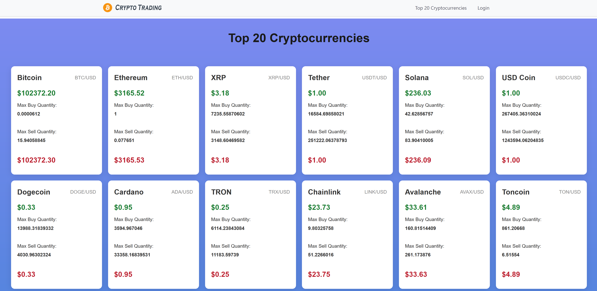
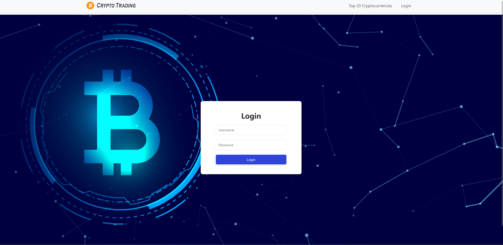
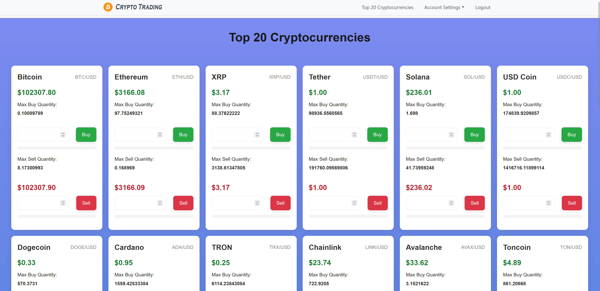
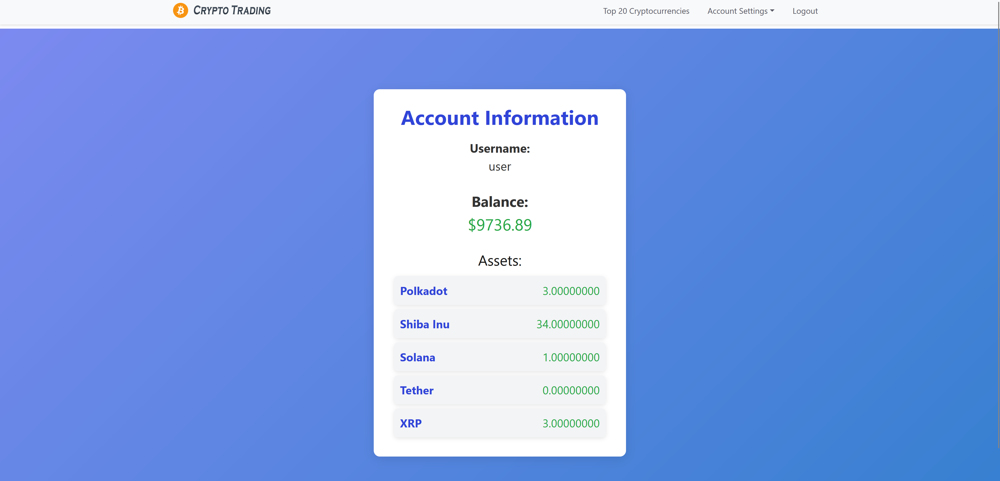
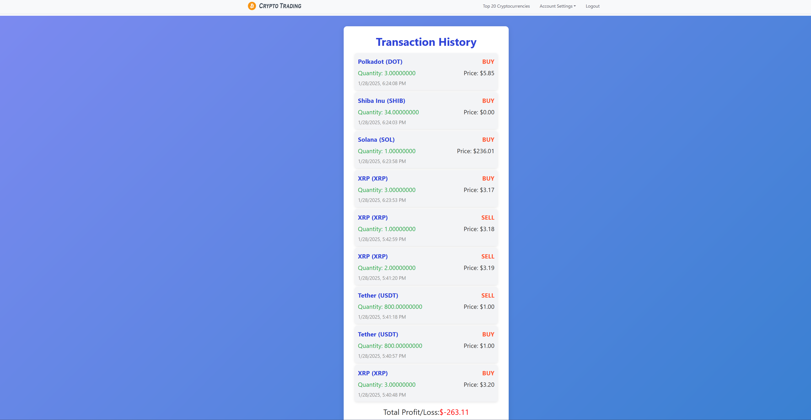
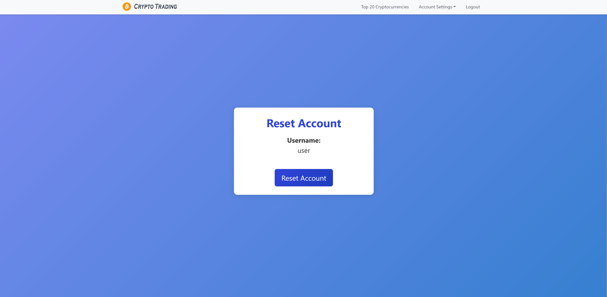

# 🚀 Crypto Trading Simulator  

A web application that simulates cryptocurrency trading using real-time data from the Kraken API. Users can trade virtual crypto, track their portfolio, and view live price updates—all without real money.  

## 🌟 Features  

✅ **Live cryptocurrency prices** (Top 20 from Kraken API)  
✅ **Virtual trading** with buying & selling functionality  
✅ **Persistent data storage** with MySQL  
✅ **User authentication** with **roles**  via JWT (Test account for now)  
✅ **Transaction history** with profit/loss tracking  
✅ **Reset account balance** feature  
✅ **REST API** for account management, transaction history, etc.  
✅ **HTTPS-Ready** (Easily configurable for secure communication)  

---

## 🛠️ Tech Stack  

### Frontend:  
- **Framework**: React (JavaScript)  
- **Styling**: CSS  
- **API Communication**: **WebSockets** for real-time price updates and **REST API** for other interactions  

### Backend:  
- **Language**: Java  
- **Framework**: Spring Boot  
- **Database**: MySQL (Persistent Storage)  
- **Security**: JWT Authentication (Test account)  
- **API Integration**: Kraken WebSocket API ([Docs](https://docs.kraken.com/api/docs/websocket-v2/ticker))  
- **WebSocket Communication**: Handles real-time price updates 
- **REST API**: Provides additional functionalities like user authentication, transactions, and account management
---

## 🔧 Setup & Installation  

### 1️⃣ Clone the Repository  

```sh
git clone https://github.com/your-username/crypto-trading-sim.git
cd crypto-trading-sim
```

---

### 2️⃣ Backend Setup (Spring Boot)  

#### Prerequisites:  
- Java 17+  
- Maven  
- MySQL  

#### Configure Database:  
Create a MySQL database and update your **`application.properties`** file:  

```properties
spring.datasource.url=jdbc:mysql://localhost:3306/cryptotradingsim?createDatabaseIfNotExist=true&autoReconnect=true
spring.datasource.username=root
spring.datasource.password=root
spring.jpa.hibernate.ddl-auto=none
spring.jpa.show-sql=true
```

#### Run the Backend:  
```sh
cd backend
mvn spring-boot:run
```
This starts the backend on **`http://localhost:8080`**.  

---

### 3️⃣ Frontend Setup (React)  

#### Prerequisites:  
- Node.js (18+)  
- npm or yarn  

#### Install Dependencies & Start the Frontend:  
```sh
cd frontend
npm install
npm start
```
This starts the frontend on **`http://localhost:3000`**.  

---

## 🔐 User Authentication (JWT)  

Currently, there is **no registration functionality**. A **test account** is provided:  

- **Username**: `user`  
- **Password**: `user`  

---

## 🌍  HTTPS  

The application is easily configurable to **HTTPS**.

---

## 📌 Usage  

1️⃣ **View Live Crypto Prices**: The homepage shows real-time prices for the top 20 cryptocurrencies.  
2️⃣ **Buy & Sell Crypto**: Enter the amount, confirm the transaction, and watch your balance update.  
3️⃣ **Track Transactions**: View a log of past trades, including profits/losses.  
4️⃣ **Reset Account**: Click the reset button to restore your starting balance.  

---

## 📹 DEMO  

 [DEMO VIDEO](https://youtu.be/hseZPRnDg3A)
 
---

## 📸 Screenshots  

| Feature | Screenshot / Video |
|---------|-----------|
| **Live Crypto (Not logged in)** |  |
| **Login Page** |  |
| **Live Crypto (Logged in)** |  |
| **Account Information** |  |
| **Transaction History** |  |
| **Reset Account** |  |

---

## 🚀 Future Improvements & Scalability 

- **User registration**  
- **Advanced trading options** (e.g., limit orders, stop-loss)  
- **User dashboard** with detailed analytics  
- **Dynamic sorting** based on real-time market cap data of cryptocurrencies   
- **Backend caching** for faster data retrieval and improved performance (e.g., caching transaction history)
- **Enhanced logging** (with structured logs, centralized logging tools)
- **Expanded unit, integration, and end-to-end tests**
- More **Custom exception handling** and **error logging**
- **Paginated responses** for larger data and requests
- **Database optimization** (e.g connection pooling, size)
- **Microservices architecture**
- **Detailed Documentation of Endpoints and Code** to improve maintainability
- **Better design, layout, and interactivity** in the frontend to improve the user experience
- **Frontend Lazy Loading** to improve page load times for larger data
---


